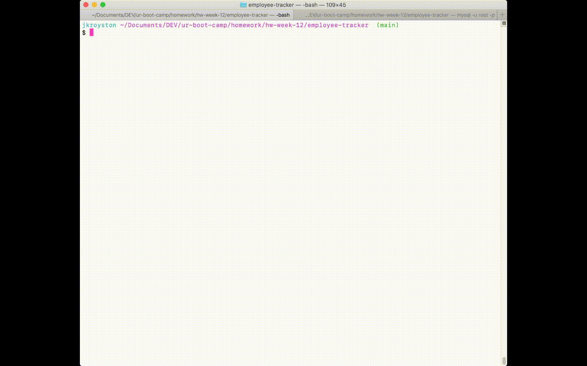

# Employee Tracking Interface


## Table of Contents
* [Description](#description)
* [Technologies](#technologies)
* [Installation](#installation)
* [Database Setup](#database-setup)
* [Usage](#usage)
* [Application Demo](#application-demo)
* [License](#license)
* [Contact](#contact)


## Description
The Employee Tracking Interface is a command line application that offers business owners a user-friendly tool for managing their employee, role, and department records. Using Node.js and Inquirer.js to run the application and connect it to a MySQL database, the interface is built around a series of command line prompts that guide users through the process of viewing, adding, updating, and deleting company records.


## Technologies
* Node.js
* JavaScript
* MySQL
* Inquirer.js
* console.table


## Installation
This application requires Node.js and npm to run. To check whether Node.js and npm are installed locally, run:
```
node -v
```
```
npm -v
```
If Node and npm are already installed, the commands above should return version numbers. Visit [Node.js](http://www.nodejs.org/) and [npm](https://docs.npmjs.com/downloading-and-installing-node-js-and-npm) for full installation details and documentation. 

To install the project and its npm dependencies, navigate to the project's root directory and run:
```
npm install
```

Once all third-party packages have been successfully installed and the database has been initialized (see below), the application is ready to use. For more details, reference the application's `package.json` file.

## Database Setup

This application uses a **MySQL** database. To use the program, you must have **SQL Server** installed and configured.

The application's `db` folder contains the database schema and a seeds file containing fictional initialization data. These files can be used to quickly get the application's database up and running using either SQL Workbench or the command line.

Below is an outline of the database schema:


## Usage
To launch the application from the command line, navigate to the project's root directory and run:

```
node index.js
```

The application's user journey is centered around the command line. Each menu selection walks the user through a specific interaction with the database. The user can easily and quickly view, add, update, and delete records from the database using nothing more than a keyboard.

Additionally, changes made to records are dynamically reflected in command line prompt choices. For example, creating a new employee will automatically add that employee to employee lists presented to users in other prompts.

## Application Demo
The following video documents the core functionality of the Employee Tracking Interface. Use this video to supplement the documentation above: 

[](https://drive.google.com/file/d/1dDtcVJEUKm1cwaYMvIKMYudEg9AmdkNZ/view)


## License
Copyright (c) 2021 J.K. Royston  
Licensed under the [MIT License](https://opensource.org/licenses/MIT).


## Contact
J.K. Royston  
<jkroyston@gmail.com>  
[GitHub](https://www.github.com/jxhnkndl)